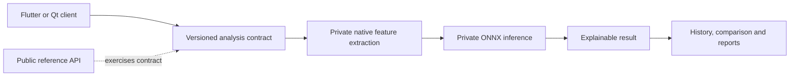

# DeepProof AI

> Privacy-first, multiplatform media-authenticity research and product engineering.

**Status:** Active development · Bachelor's thesis project · Sanitized public companion

[](https://github.com/DVdiego/deep-proof-ai/actions/workflows/ci.yml)

DeepProof AI investigates how local and multimodal analysis can help estimate whether an image or video may have been generated or manipulated by artificial intelligence. Results are probabilistic indicators for review, never forensic conclusions.

## Development provenance

This repository preserves the real development history of two application lines originally maintained separately: the Qt/QML desktop client and selected Flutter application layers. Commit authorship and dates are retained. The histories were combined only after detector internals and product-sensitive components had been removed from every exported revision.

The research backend remains private while the Bachelor's thesis is in progress.

## Repository map

```text
clients/
  desktop/   Qt/QML application, public engine contract and API adapter
  mobile/    selected Flutter analysis, history and reporting layers
contracts/   safe versioned contracts shared across application boundaries
src/         executable FastAPI reference decision layer
tests/       validation for the public reference API
```

The application sources are genuine project extracts. The public FastAPI service is an isolated reference adapter that lets reviewers exercise the contracts without the private detector, datasets or model package.

## Public/private boundary

**Public here**

- Qt/QML desktop application history and engine abstraction.
- Selected Flutter domain and application components.
- Safe analysis and history boundaries shared by the clients.
- Explainable reference API using synthetic inputs and illustrative weights.
- Automated API tests and a reproducible request example.

**Kept private until submission and defence**

- Training and evaluation datasets.
- Feature extraction and native inference implementation.
- Model architecture, training pipeline and trained weights.
- Calibration thresholds and complete experimental results.
- C2PA, watermark and signature-fusion research in progress.
- Store, entitlement and production service configuration.

The public scores and weights do not reproduce the research detector or disclose its differentiating logic.

## Run the public reference API

```bash
python -m venv .venv
source .venv/bin/activate
pip install -e ".[dev]"
pytest -q
uvicorn deepproof.api:app --reload
curl -X POST http://localhost:8000/v1/analyze \
  -H "Content-Type: application/json" \
  --data @examples/suspicious-video.json
```

## System boundary



## Representative stack

`Flutter` · `Dart` · `Qt/QML` · `C++` · `Python` · `FastAPI` · `PyTorch` · `OpenCV` · `MediaPipe` · `ONNX Runtime`

## Source availability

The contents are visible for portfolio review and technical evaluation; no general reuse license is granted. See [NOTICE.md](NOTICE.md). The original private repositories remain the source of truth for active development.
